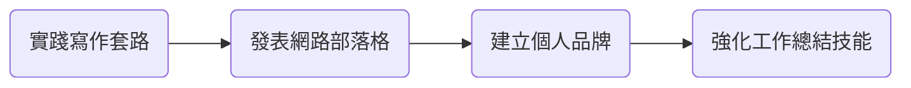

+++
title = "ART001 文章概覽"
date = 2021-12-21T19:53:24+08:00
#featured = true
comment = false
toc = true
#reward = true
#pinned = true
math = true 
categories = [
]
tags = [ "邏輯流"
]
series = [
]
#images = []
#[menu.footer]
#  parent = "docs"
#  weight = 2
+++

這是第一篇文章

## 思考一: 實踐寫作套路, 學習寫作工作總結

1. 想要研究寫作的套路，早上看了一些關於文案寫作的書。但他們的性質跟我們平常知識生產的模式不太一樣。
2. 在網路上寫部落格的原因是什麼? 我想是經營個人品牌。因為我自己都還沒有個人網站。
3. 那為什麼要建立個人品牌呢因為在現在這個時代我們找工作的履歷不再只是一張紙, 而是一個網站可以表現我們過去幾年的工作。
4. 這個有點像在寫工作總結，那怎麼寫好工作總結呢？我覺得這就是可以看得到App上面的課程。

### 流程圖原始碼
---

## 思考二: 邏輯流

邏輯流治天下